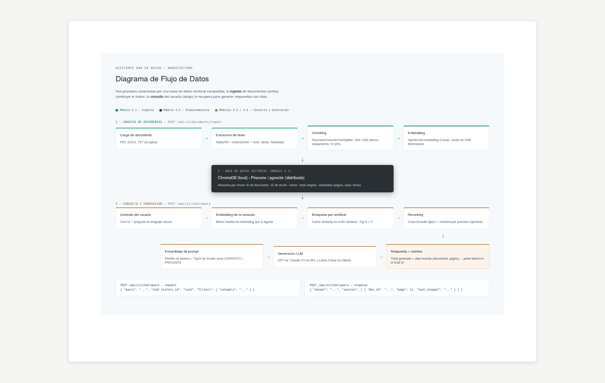

# Documentación de diseño

Fuente de verdad funcional del sistema. Cualquier cambio de alcance debe reflejarse aquí antes
de abrir la rama correspondiente.

| Archivo | Contenido |
|---|---|
| [`documento_diseno_rag.pdf`](documento_diseno_rag.pdf) | Arquitectura y diseño del sistema: requisitos, módulos 3.1–3.4, especificación de endpoints, UIs y stack tecnológico (agosto 2026). |
| [`diagrama-flujo-datos.png`](diagrama-flujo-datos.png) | Diagrama de flujo de datos: pipeline de ingesta, base de datos vectorial y flujo de consulta/generación. |

